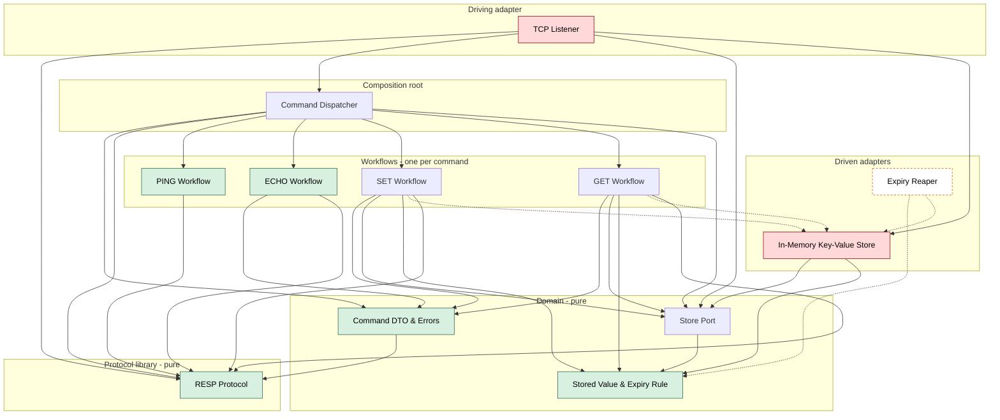
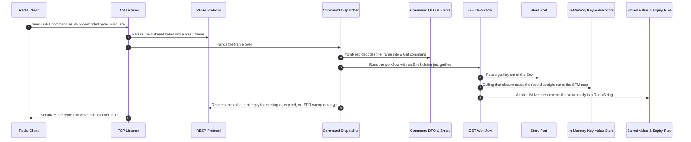
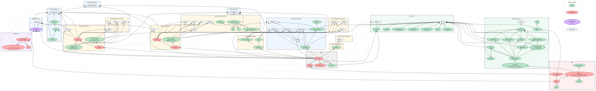

[](https://app.codecrafters.io/users/dmsoares?r=2qF)

# Redis, from scratch, in Haskell

A toy Redis server built for the CodeCrafters
["Build Your Own Redis"](https://codecrafters.io/challenges/redis) challenge.

The challenge is the excuse. I want a codebase small enough to
hold in my head and real enough to have opinions about, so I can use it to learn
things that have nothing to do with Redis. See [Where this is going](#where-this-is-going).

## What works today

| Command                           | Notes                                                      |
| --------------------------------- | ---------------------------------------------------------- |
| `PING`                            |                                                            |
| `ECHO <msg>`                      |                                                            |
| `SET <key> <value> [EX s\|PX ms]` | `EX` and `PX` together is an error, as in real Redis       |
| `GET <key>`                       | Expiry is applied on read; a wrong-typed value is an error |

Errors come back as real RESP errors (`-ERR unknown command`), not as a null
bulk string. Values are typed — `RedisString` today, `RedisList` is defined and
waiting for the commands that need it.

## Running it

Needs `stack` and GHC 9.8.4 (the snapshot pins it; `codecrafters.yml` uses the
`haskell-9.8` buildpack).

```sh
./your_program.sh          # build and run on :6379
redis-cli -p 6379 ping     # or just: nc localhost 6379
codecrafters submit        # run the challenge test suite
```

## Architecture

The organising idea is **one workflow per command**. A workflow is a small
module group that owns a single command end to end: its input type, its reply
type, and the steps between them. It declares the effects it needs as `mtl`
constraints and never names a monad stack — the dispatcher picks a runner.

That makes `PING` and `ECHO` literally pure values, and it means adding a
command is adding a module group, not editing a growing `case`.



### A command end to end



The store hands back whatever record it holds. Every decision after that —
expired, wrong type, missing — belongs to the workflow, and only two of the
three are a nil reply.

## Pure vs effectful

A call graph of every top-level binding, generated from GHC's own `.hie` files
by [calligraphy](https://github.com/jonascarpay/calligraphy), then coloured by
what each binding's type actually promises.

[](architecture/callgraphs/purity-overlay.svg)

|                 | Bindings | 🟢 pure      | 🟠 pure logic, effectful type | 🔴 effectful | 🟣 port |
| --------------- | -------- | ------------ | ----------------------------- | ------------ | ------- |
| Workflows       | 16       | **12**       | 0                             | 4            | 0       |
| Domain          | 7        | 6            | 0                             | 0            | 1       |
| `Resp` library  | 20       | **20**       | 0                             | 0            | 0       |
| Root + adapters | 13       | 4            | 0                             | 9            | 0       |
| **Total**       | **56**   | **42 (75%)** | **0**                         | 13 (23%)     | 1       |

The amber bucket is the point of the exercise. It means _this function does no
I/O, but its type says it might_ — pure logic that got dragged into `IO` because
it was written in the wrong place. It's the bucket a type-directed tool can't
find, because the type is the thing that's wrong, so the classification is a
hand-maintained table in
[`annotate_purity.py`](architecture/callgraphs/annotate_purity.py).

It is currently **empty**, down from 12% of all bindings when I first measured it.
The last entry disappeared when the store adapter stopped building records.

## Keeping the diagrams honest

Architecture diagrams rot. The defence here is that the C4 model records which
modules each component owns, and a script checks that against the real call
graph:

```sh
stack build --ghc-options -fwrite-ide-info
python3 architecture/check_drift.py
```

It reports two kinds of drift — a documented relationship with no real module
dependency behind it, and a real dependency with nowhere to go in the diagram.
It has caught me several times; every correction in the model so far came from
it rather than from re-reading the code.

- [`architecture/workspace.dsl`](architecture/workspace.dsl) — the C4 model
  (Structurizr DSL). The Mermaid above is projected from it by
  [`dsl_to_mermaid.py`](architecture/dsl_to_mermaid.py), so it can't drift.
- [`architecture/callgraphs/`](architecture/callgraphs/) — generated call graphs
  and the purity overlay.
- [`architecture/reviews/`](architecture/reviews/) — design reviews, rewritten
  each time the structure changes.
- [`decisions/`](decisions/) — ADRs.

## Where this is going

The Redis part is a means, not the end. This repo is a small, honest, real
codebase I can point other tools and techniques at:

- **Testing** — property-based testing and fuzzing, starting with the RESP codec
  (`toBytes`/`fromBytes` should round-trip) and the expiry rule, both of which
  are total functions with no I/O. There is no test suite yet; that's next.
- **AI-driven code review** — repeated structural reviews over a codebase whose
  history I know, to see what the reviews actually catch and what they miss.
- **AI-driven architecture diagramming** — the `check_drift.py` /
  `workspace.dsl` / call-graph loop above is the first attempt at making
  generated diagrams verifiable rather than decorative.
- More as I go.

## Known gaps

Honest list, roughly in the order I'd fix them:

1. **Pipelined commands are dropped.** Three `PING`s in one TCP segment get one
   `+PONG`. `fromBytes` discards the unconsumed remainder and the read buffer
   doesn't survive a command.
2. **`$-1` doesn't round-trip** — the null-bulk-string parser is unreachable, so
   the server can't parse its own output for a missing key.
3. **Wrong arity reports as an unknown command**, because `fromResp` has one
   `Nothing` for two different failures.
4. **No active expiry.** Keys that are never read again are never reclaimed
   (ADR 0002).

## Layout

```
app/Main.hs              TCP accept loop, read buffer, wire format at both ends
lib/Redis.hs             dispatcher + composition root — the only concrete monad stack
lib/Redis/Data/          command DTOs, errors, the store port, the record and its expiry rule
lib/Redis/Store.hs       STM-backed map implementing the port
lib/Redis/Workflows/     one module group per command
lib/Resp/                standalone RESP codec, no dependency on Redis
architecture/            C4 model, call graphs, drift check, reviews
decisions/               ADRs
```
