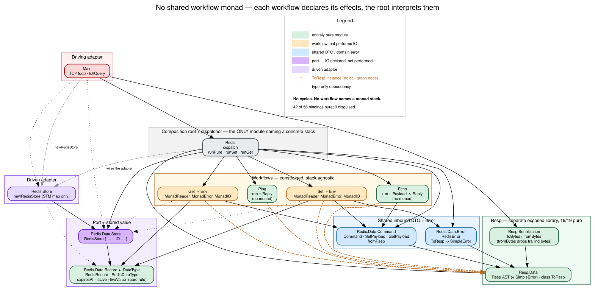

# Design review — structure & layering

**First published:** 2026-09-05 · **Revised:** 2026-09-17, round 5
**Reviewed at:** `ca6c2c1` *add simple error; extract live value logic*
**Lens:** DDD / *Domain Modeling Made Functional*, plus Haskell effect-management practice
**Evidence:** `architecture/callgraphs/layers.svg`,
`architecture/callgraphs/purity-overlay.svg`, a clean `-Wall` build, and a 14-probe suite
fired at a live server on :6379

> The working tree at the time of writing has an in-flight extraction of `RedisRecord` into
> a new `Redis.Data.Record` module. It does not compile yet (the new module has no import
> list), so it is excluded from every measurement below. See §5.

---

## Round 5 in one paragraph

Three of round 4's seven recommendations landed, and they were the three that mattered:
`Resp` can now express an error, the parser no longer rejects spaces, and the expiry rule
is a named pure function. **Failures are real replies now** — `-ERR unknown command`
instead of `$-1` — which closes the gap that had been the top item in every review since
round 1. Purity is **72% pure / 2% disguised** across 57 bindings, and the one remaining
business rule in the program is a total function over the record it constrains. That leaves
exactly one structural defect, and it is now measured rather than inferred: **pipelined
commands are silently dropped.** Three `PING`s in one TCP segment get one `+PONG`.

---

## Scorecard

| Principle | R1 | R2 | R3 | R4 | R5 | Note |
|---|---|---|---|---|---|---|
| 1. Ubiquitous language | good | good | good | good | **good** | one module group per command |
| 2. Illegal states | weak | weak | good | excellent | **excellent** | `UnknownError` unrepresentable, not merely unused |
| 3. Effect ignorance | broken | broken | good | excellent | **excellent** | no workflow names a monad stack |
| 4. Pipelines | excellent | excellent | excellent | excellent | **excellent** | constraints accumulate through `>=>` |
| 5. Domain errors | broken | broken | broken | weak | **good** | real `-ERR` replies; arity still conflated with unknown command |
| 6. Sandwich | weak | mixed | mixed | good | **excellent** | 41/57 pure; the one business rule is now pure |
| 7. Simple types | weak | weak | good | good | **good** | per-workflow `newtype Key`/`Value` |
| 8. DTOs at the boundary | broken | good | good | good | **good** | `Resp` is a separate 20/20-pure library |
| 9. Inward dependencies | weak | weak | good | good | **good** | verified from the import graph |

Not a DMMF principle, so not in the table, but it is now the headline: **wire-protocol
framing is the one broken thing left.** §4.1.

---

## 1. What landed since round 4

Verified against the diff, not the commit message.

**`Resp` gained an error constructor** (`SimpleError`, `simpleError`, `pSimpleError`,
a `toBytes` clause) and `ToResp RedisError` stopped lying:

```haskell
instance ToResp RedisError where
    toResp UnknownCommand           = simpleError "ERR unknown command"
    toResp ConflictingExpiryOptions = simpleError "ERR conflicting expiry options"
    toResp (MalformedExpiry s)      = simpleError $ "ERR malformed expiry:" <> s
```

Round 4's version was `toResp _ = nullBulkString` with a comment apologising for it. Three
probes changed behaviour as a direct result (§4).

**`pPureString` became `pSimpleString`** with `takeWhileP Nothing (/= 13)`, which is what
made the above safe to ship: the old `some alphaNumChar` could not read back an error reply
containing a space. `alphaNumChar` is no longer imported. `pArrayLength` is gone, inlined
as `pArray`'s local `pLength`.

**The expiry rule is a pure function**, in `Redis.Data.Table`, next to the record it
constrains:

```haskell
expiresAt :: RedisRecord -> Maybe UTCTime
isLive    :: UTCTime -> RedisRecord -> Bool
liveValue :: UTCTime -> RedisRecord -> Maybe Value
```

The adapter's `get` closure now performs exactly two effects — read the clock, read the
map — and decides nothing. This was the last business rule hidden inside `IO`, and it is
the reason principle 6 moves to *excellent*: the sandwich is no longer aspirational at the
one place it actually mattered.

The decomposition into three functions is load-bearing rather than decorative. ADR 0002's
Expiry Reaper needs `isLive`, not `liveValue` — it sweeps records nobody asked for, so it
wants the predicate and not the value. Two eviction paths now agree on expiry because they
share a function, not because someone kept two comparisons in sync. That makes the ADR's
promise — *"lazy expiry-on-read stays in place as a correctness backstop"* — structurally
true.

Also quietly fixed: `Get.workflow` is `execute . deserializeInput` (the redundant `pure .`
is gone), and `EchoPayload`'s constructor is no longer called `EchoDto`.

---

## 2. The mtl decision, one round on



Round 4's change — delete the shared `Workflow` alias, let each workflow declare mtl
constraints, let `dispatch` pick a runner per effect shape — has held up. The three runners
in `lib/Redis.hs` are still visibly different, which is the whole point:

```haskell
runPure :: (ToResp a) => a -> IO Resp
runPure = pure . toResp
runSet env = fmap (either toResp toResp) . runExceptT . flip runReaderT env
runGet env = fmap toResp . flip runReaderT env      -- no runExceptT: GET cannot fail
```

### 2.1 Where this sits in Haskell practice

The prevailing default is the **ReaderT pattern**: FP Block's article recommends "your
application code will, in general, live in `ReaderT Env IO`… define it as
`type App = ReaderT Env IO` if you wish", and presents mtl constraints as an *optional*
enhancement — "instead of directly using the `App` datatype, write your functions in terms
of mtl-style typeclasses like `MonadReader` and `MonadIO`, which will allow you to recover
some of the purity."

This codebase took the optional path, and the literature supports it for this shape of
problem: mtl style "leads to more options for composition and types that are more
expressive of what effects are actually being used", and the standing advice is "if you can
generalize your functions to mtl-style Monad constraints, do it, you'll regain a lot of the
benefits you'd have with purity."

For a server whose structure is *one workflow per command*, where the commands genuinely
differ in what they need, the constrained style is the better fit. A single `App` would be
the union of every effect any future command might want.

Two costs, neither of which bites at this size: effect-polymorphic functions add a function
application per bind (GHC usually specialises it away, since `dispatch` knows the concrete
monad); and mtl resolves instances outward-in, which bites only with duplicated effects.

### 2.2 The scaling risk to watch

`dispatch` does two jobs: routing *and* effect interpretation. With four commands its
`where`-clause is clearer than an alias. At fifteen, `Redis.hs` becomes the file that knows
every workflow's effect signature, with fifteen bespoke runner lines.

The signal is **two workflows wanting the same runner**. That is when a shared combinator
earns its place — named for the effect shape, not for "workflow":

```haskell
runFallible :: (ToResp e, ToResp a) => r -> ExceptT e (ReaderT r IO) a -> IO Resp
runReading  :: (ToResp a)           => r -> ReaderT r IO a -> IO Resp
```

Several honest combinators beat both one union alias and N one-offs. Don't pre-build them.

### 2.3 Correcting round 4 on the import asymmetry

Round 4 claimed the root imports `Control.Monad.Trans.Except`/`Trans.Reader` from
*transformers* while the workflows import the mtl modules. That is not what the code does.
`Redis.hs` imports `Control.Monad.Except (runExceptT)` and
`Control.Monad.Reader (ReaderT (runReaderT))` — both mtl modules, which re-export the
transformer types.

The asymmetry is real but finer than stated: the root and the workflows import the *same
modules* and take different things out of them — the root takes type constructors and
runners, the workflows take only classes. Correspondingly, `transformers` is not a direct
dependency of anything and shows up under `-Wunused-packages`.

---

## 3. Pure vs effectful


| Group | Bindings | 🟢 pure | 🟠 disguised | 🔴 effectful | 🟣 port |
|---|---|---|---|---|---|
| Workflows | 15 | **11** | 0 | 4 | 0 |
| `Redis.Data` (DTO, error, rule) | 7 | 6 | 0 | 0 | 1 |
| `Resp` (library) | 20 | **20** | 0 | 0 | 0 |
| Root + adapters | 15 | 4 | 1 | 10 | 0 |
| **Total** | **57** | **41 (72%)** | **1 (2%)** | 14 (25%) | 1 |

The trend: **58% → 60% → 65% → 71% → 72% pure**, disguised **12% → 8% → 6% → 2% → 2%**.

The percentage barely moved, which is the honest reading — round 4 had already taken the
amber band down to a single binding. What changed is *which* pure functions exist. The
three new `Redis.Data.Table` bindings are the first pure functions in this codebase that
encode a **rule** rather than a translation; everything green before them was a codec or a
constructor. That is the distinction principle 6 is actually about, and it does not show up
in a percentage.

The one remaining disguised binding is `record` inside `newRedisTable`'s `set` closure — a
pure `RedisRecord` value with no name at the top level. It is the sort of thing that only
matters if something else ever needs to construct a record, which the reaper will.

`Resp` is 20 of 20 pure and imports nothing from `Redis`. `Redis.Data.Table`'s only
non-pure node is the `RedisTable` port record, which *declares* `IO` without performing it.

---

## 4. Probes — live server on :6379

| # | Sent | Expected | R3 | R4 | R5 |
|---|---|---|---|---|---|
| 1–4 | `PING`, `ECHO`, `SET`/`GET`, `GET missing` | — | ✅ | ✅ | ✅ |
| 5–7 | colon key, value with a space, empty value | `+OK` | ✅ | ✅ | ✅ |
| 8 | `ECHO split` in 2 TCP segments | `$5 split` | wedged | ✅ | ✅ |
| 9 | unknown command `QUIT` | `-ERR unknown command` | `$-1` | `$-1` | **✅ fixed** |
| 10 | `SET k` (missing value) | `-ERR wrong number of args` | `$-1` | `$-1` | ⚠️ `-ERR unknown command` |
| 11 | `SET a b EX 10 PX 500` | an error | `+OK` | `$-1` | **✅ `-ERR conflicting expiry options`** |
| 12 | 3× `PING` in one TCP segment | 3× `+PONG` | — | — | ❌ **one `+PONG`** |
| 13 | `SET p q` + `GET p` in one segment | `+OK` then `$1 q` | — | — | ❌ **`+OK` only** |

Probes 9 and 11 are the round's payoff: two distinct failures now produce two distinct,
readable replies. Probe 10 is a partial — it answers, but with the wrong message, because
`fromResp` returns `Nothing` for *both* an unrecognised verb and a recognised verb with the
wrong arity. One `Nothing` cannot carry two reasons; a three-way result
(`Unknown` / `BadArity` / `Ok`) would separate them.

Probes 12 and 13 are new, and they fail. Both were drained with a 1.2 s timeout — nothing
further arrives. The second and third commands are not delayed, they are **gone**.

### 4.1 Pipelining — the one broken thing left

The information is discarded in two independent places, and fixing either alone does
nothing.

**`fromBytes` throws away the tail.** `runParser` does not require `eof`, so this already
succeeds on a buffer holding three commands, returns the first, and drops the rest:

```
fromBytes (ping <> echo <> ping)  ->  Just (Array 1 [BulkString 4 "PING"])
```

**`fullQuery` throws away the buffer.** `forever $ do query <- fullQuery socket ""`
restarts from `""` on every command, so even a remainder-returning parser would have
nowhere to put it. The buffer's lifetime is one command; pipelining needs it to be one
connection.

#### The parser change

```haskell
data Parsed
    = Complete Resp BS.ByteString  -- ^ a frame, and the bytes that followed it
    | Incomplete                   -- ^ a valid prefix — more bytes may complete it
    | Invalid                      -- ^ no continuation can make this valid

fromBytes :: BS.ByteString -> Parsed
fromBytes bytes = case runParser withRest "" bytes of
    Right (value, rest) -> Complete value rest
    Left err
        | truncated err -> Incomplete
        | otherwise -> Invalid
  where
    withRest = (,) <$> pRedisValue <*> getInput

-- | Did the parse fail only because the input ran out?
truncated :: ParseErrorBundle BS.ByteString Void -> Bool
truncated = all ranOut . bundleErrors
  where
    ranOut (TrivialError _ (Just EndOfInput) _) = True
    ranOut _ = False
```

`getInput` after `pRedisValue` *is* the remainder — no `runParser'` state plumbing needed,
because the parser already sits at the right offset when it succeeds.

The `Incomplete`/`Invalid` split is decidable, and `EndOfInput` is the right discriminator:
`$3\r\nab` is a prefix of something valid, `$x` is not, no matter what arrives next. `all`
rather than `any` is the conservative direction. Verified on nine inputs:

| input | result |
|---|---|
| `""` | `Incomplete` |
| one `PING` frame | `Complete` … rest `""` |
| the same frame ×3 | `Complete` … rest = **the other two frames** |
| `PING` + 9 bytes of an `ECHO` | `Complete` … rest `"*2\r\n$4\r\nE"` |
| `*1\r\n$4\r\nPI` | `Incomplete` |
| `*1\r\n$4\r` | `Incomplete` |
| `$x\r\nab\r\n` | `Invalid` |
| `%2\r\n` | `Invalid` |
| `$-1\r\n` | `Invalid` *(the `pNullBulkString` bug, §5)* |

#### The loop change

`fullQuery` and `forever` collapse into one function whose state is the buffer:

```haskell
serveClient :: Socket -> RedisTable -> ByteString -> IO ()
serveClient socket table buffer = case Resp.fromBytes buffer of
    Resp.Complete query rest -> do
        processQuery socket table query
        serveClient socket table rest
    Resp.Invalid ->
        send socket (Resp.toBytes (SimpleError "ERR Protocol error"))
    Resp.Incomplete -> do
        mBytes <- recv socket segmentSize
        case mBytes of
            Nothing -> pure ()
            Just bytes -> serveClient socket table (buffer <> bytes)
```

The whole change is the **order of the `case` and the `recv`**. Checking the buffer *before*
touching the socket is what makes pipelining work: after replying to the first `PING`,
`rest` may already be a complete second command, and it is answered without a syscall.
`recv` is reached only in the one state that needs it. Run against a scripted socket:

```
three commands in one TCP segment    recv "PING;PING;PING;"  -> 3 replies, 1 recv
one command split across segments    recv "PI", recv "NG;"   -> 1 reply
two commands, second split           recv "PING;PI" -> reply, recv "NG;" -> reply
client closes mid-frame              1 reply, then returns
protocol error                       one error reply, then returns
```

Two things fall out for free. `forever` is gone, so the function *returns* on EOF, which
makes the long-unreachable `closeSock` reachable — or lets you drop it, since
`network-simple`'s `serve` closes the socket itself. And `Incomplete` stops being the answer
to garbage: `$-1\r\n` currently makes `fullQuery` recurse waiting for bytes that will never
help, a silent hang. It becomes a reply the client can read.

#### Two traps in that change

**Don't put the parse error on the wire.** A RESP simple error is `-msg\r\n`, so the message
must contain no CR or LF — and `errorBundlePretty` is multi-line with source excerpts. That
is why `Invalid` above carries nothing and `Main` sends a fixed string. If you want detail,
carry the byte offset, not the rendering.

**The buffer becomes explicitly long-lived, which makes an existing hole visible.**
`$999999999\r\n` keeps the parse `Incomplete` while the buffer grows without bound. Today's
`fullQuery` has the same problem by recursion, so this is not introduced — but once the
buffer is a named argument it is obvious, and the fix is a cap: a buffer over some size with
no complete frame is `Invalid`.

---

## 5. Smaller things

- **The `Resp` façade cannot be used to write instances.** `lib/Resp.hs` exports `ToResp`
  abstractly — `ToResp`, not `ToResp (..)` — and omits `simpleError`. So every module that
  defines a `ToResp` instance has to reach past the façade into `Resp.Data` for the method.
  That is seven `import Resp.Data` lines in `Redis/*`, each next to an `import Resp` line
  for the smart constructors. Exporting `ToResp (..)` and `simpleError` collapses each pair
  into one import and makes `Resp.Data` genuinely internal.
- **`pNullBulkString` is still unreachable.** `pBulkString` consumes `$` before `L.decimal`
  rejects `-`, and `<|>` does not backtrack after input is consumed. `$-1\r\n` — the
  server's own output for a missing key — does not round-trip. Merge the two into one
  `$`-parser that reads the length once and branches on its sign.
- **Arity errors are reported as unknown commands** (probe 10). `fromResp :: Resp -> Maybe
  Command` has one failure slot for two failures.
- **`Redis.Table` still has `import Prelude hiding (exp)`** — needed only by the expiry
  comparison that moved out. Dead now.
- **`-Wall` is clean at HEAD.** `-Wunused-packages` reports nine unused by the library:
  `async`, `attoparsec`, `containers`, `network`, `network-simple`, `parsec`,
  `parser-combinators`, `text`, `transformers`. (`network-simple` is used by the executable;
  the warning is per component.)
- **The in-flight `Redis.Data.Record`.** Splitting `RedisRecord` and its rule out of
  `Redis.Data.Table` is the right call and sharpens §1: `RedisRecord` is used by exactly one
  module today, while `RedisTable`, `SetOptions` and the `Key`/`Value` aliases cross the
  port. Keeping the record in the same module as the port conflates private storage shape
  with the published interface. As committed to the working tree it lacks an import list, so
  it does not compile; the three functions need `Data.Time (UTCTime, NominalDiffTime,
  addUTCTime)` and `Value` from wherever that alias ends up.
- **`workspace.dsl` is still three refactors stale** and `check_drift.py` reports MISSING
  edges against it.

---

## 6. What I'd change, in order

1. **Make `fromBytes` three-way and give the loop a persistent buffer.** *(§4.1)* This is
   the only remaining correctness defect that a real client would hit — `redis-cli` and
   every client library pipeline.
2. **Merge `pBulkString` with `pNullBulkString`** so the server can read its own `$-1`.
   *(§5)*
3. **Export `ToResp (..)` and `simpleError` from `Resp`**, then delete the seven
   `import Resp.Data` lines in `Redis/*`. *(§5)*
4. **Finish the `Redis.Data.Record` split** — add the import list, and take the chance to
   decide where `Key`/`Value` live. *(§5)*
5. **Make `fromResp` distinguish arity from unknown verb**, so probe 10 gets the right
   message. *(§4)*
6. **Delete the leftovers**: `Prelude hiding (exp)`, `closeSock` (after §4.1 makes it
   reachable, decide whether you want it at all), and the unused dependencies.
7. **Refresh `workspace.dsl`.** *(§5)*
8. **Watch for two workflows wanting the same runner**, then extract a named combinator —
   not before. *(§2.2)*

---

## Appendix — reproducing

```sh
stack build --ghc-options -fwrite-ide-info
BUILD=.stack-work/dist/x86_64-linux-nix/ghc-9.8.4/build

nix shell nixpkgs#haskell.packages.ghc984.calligraphy --command calligraphy \
    -i $BUILD Redis Redis.Data.Command Redis.Data.Error Redis.Data.Table Redis.Table \
    Redis.Workflows.{Ping,Echo,Get,Set} Redis.Workflows.{Ping,Echo,Get,Set}.Data \
    Resp Resp.Data Resp.Serialization Main \
    --collapse-data --output-dot values.dot
python3 architecture/callgraphs/annotate_purity.py values.dot purity.dot
dot -Tsvg purity.dot -o architecture/callgraphs/purity-overlay.svg
dot -Tsvg architecture/callgraphs/layers.dot -o architecture/callgraphs/layers.svg
```

Two gotchas worth writing down. `calligraphy` must match the project's GHC or it panics on
the `.hie` version — hence the `ghc984` nix shell. And `--show-module-path` also switches
the `MODULE` arguments to match against paths, so the two cannot be mixed; `annotate_purity.py`
therefore keys its table on module *names*, which is what calligraphy labels clusters with
by default.

The purity classification is a hand-maintained table in `annotate_purity.py`, not inferred:
the interesting bucket — *pure logic wearing an effectful type* — is exactly the one a
type-directed classifier cannot find, because the type is the thing that's wrong. That
bucket is down to one binding.

## Sources

- [The ReaderT Design Pattern](https://academy.fpblock.com/blog/2017/06/readert-design-pattern/) — FP Block
- [Modular effects in Haskell through effect polymorphism](https://dl.acm.org/doi/pdf/10.1145/3331545.3342589)
- [Equational Reasoning for MTL Type Classes](https://arxiv.org/pdf/2007.00616)
- [Monad transformers, free monads, mtl, laws](https://blog.ocharles.org.uk/posts/2016-01-26-transformers-free-monads-mtl-laws.html) — ocharles
- [C4 model — the Code level is tool-generated](https://c4model.com/diagrams/code)
