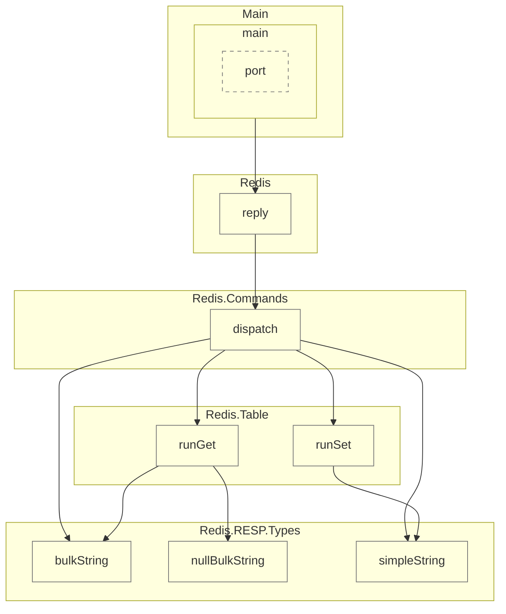
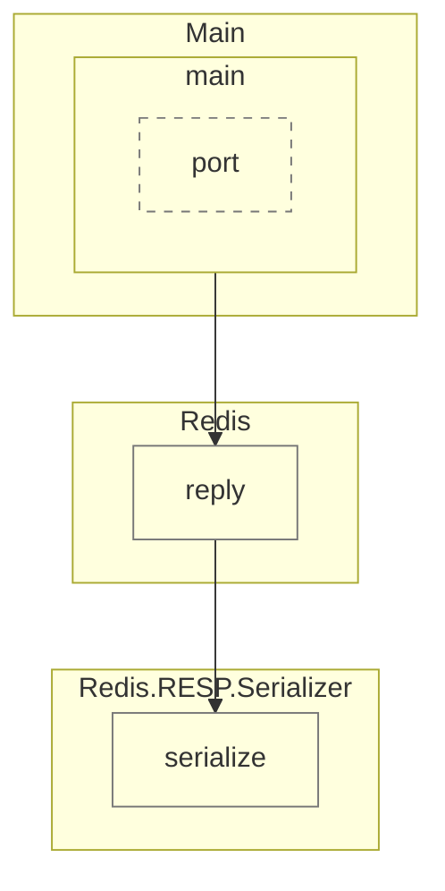

# 3. Move RESP serialization to the TCP Listener

Date: 2026-08-30

## Status

Proposed

> **Terminology note.** This ADR predates the re-levelling of the C4 model.
> Capitalised names below like "RESP Parser", "RESP Serializer", "Command
> Deserializer" and "Command Dispatcher" describe *code roles* — the modules
> `Redis.RESP.Parser`, `Redis.RESP.Serializer`,
> `Redis.Commands.Deserialization` and `Redis.Commands`/`Redis`. They are no
> longer separate C4 components: the first two are now internal to the **RESP
> Protocol** component and the last two to the **Command Handler** component.
> The argument is unaffected — it was always a code-level argument, which is
> precisely why the component diagram turned out to be the wrong place to make
> it.

## Context

Today the inbound and outbound paths through the Redis Server are
asymmetric, and the asymmetry runs deeper than just "who calls the
serializer."

Inbound, there are genuinely two separate layers. `RESP.parse :: ByteString
-> Maybe Resp` is a pure protocol codec with no knowledge of Redis commands.
`fromResp :: Resp -> Maybe Command`, inside the Command Deserializer, is a
translation layer that maps the protocol AST onto a domain type. Once
`fromResp` runs, `Resp` never crosses into the Command Dispatcher — it only
ever sees a typed `Command`.

Outbound, that translation layer doesn't exist. `Resp` is constructed
directly inside the business logic itself, at more than one point:

```haskell
-- Redis.Commands
dispatch :: RedisTable -> Command -> IO Resp
dispatch _ (Echo msg) = pure $ RESP.bulkString msg

-- Redis.Table
runSet :: RedisTable -> Key -> Value -> SetOptions -> IO Resp
runSet ... = do redisSet ...; pure $ RESP.simpleString "OK"
runGet :: RedisTable -> Key -> IO Resp
runGet ... = pure $ maybe RESP.nullBulkString RESP.bulkString mValue
```

`Redis.Table` (the In-Memory Key-Value Store) imports `Redis.RESP` and
builds `Resp` values itself. There is no domain-level result type anywhere
in the outbound path — `Resp`, a protocol-level type, *is* the return type
of the business logic, all the way down into storage. `Redis.reply` then
just composes `Commands.dispatch` with `RESP.serialize` on top of that.

So "RESP Parser" and "RESP Serializer" look like mirror-image components —
same technology, opposite direction — but they don't sit at mirrored depths
in the pipeline. The Parser is nested behind a translation layer the
business logic never sees through; the Serializer's would-be mirror
translation layer doesn't exist, so the business logic speaks the wire
protocol natively.

## Evidence

The claims above aren't just from reading the source — they're reproducible
from the compiler's own name-resolution data via
[calligraphy](https://github.com/smunix/calligraphy), which builds call
graphs from GHC `.hie` files. Generated with:

```
stack build --ghc-options -fwrite-ide-info
calligraphy -i .stack-work/dist/*/ghc-*/build \
  -r Redis.RESP.Types.simpleString \
  -r Redis.RESP.Types.bulkString \
  -r Redis.RESP.Types.nullBulkString \
  --stdout-mermaid
```

Everything that transitively calls into `Resp` construction today — proving
the "business logic hand-builds `Resp`" claim mechanically, not just by
inspection:



And with `-r Redis.RESP.Serializer.serialize` instead, everything that
transitively calls the serializer — confirming it's called from exactly one
place today (`Redis.reply`, bundled into the Command Dispatcher component in
this model), not from the TCP Listener:



Re-run these commands after implementing the `Reply` type and Reply
Serializer to confirm the fix actually landed: `Redis.Commands` and
`Redis.Table` should no longer appear as ancestors of the `Redis.RESP.Types`
constructors.

## Decision

Two parts, together:

1. Introduce a domain-level `Reply` type (e.g. `ReplyOk | ReplyBulk
   ByteString | ReplyNil`, covering PING/ECHO/SET/GET's current outcomes)
   that `Commands.dispatch` and `Redis.Table.runSet`/`runGet` return instead
   of `Resp`. Neither the Command Dispatcher nor the In-Memory Key-Value
   Store construct `Resp` values, or import `Redis.RESP`, any more.
2. Add a new **Reply Serializer** component that maps `Reply -> Resp`,
   mirroring the `fromResp :: Resp -> Command` mapping done by the Command
   Deserializer. The TCP Listener calls it after dispatch returns; it
   delegates to the existing RESP Serializer for the final `Resp -> bytes`
   step.

This makes the two pipelines structurally symmetric:

```
inbound:  bytes -[RESP Parser]-> Resp -[Command Deserializer]-> Command
outbound: Reply -[Reply Serializer]-> Resp -[RESP Serializer]-> bytes
```

In the C4 model this shows up as one relationship disappearing: the
`In-Memory Key-Value Store -> RESP Protocol` dependency is tagged
`Superseded`, so it appears in `ComponentsCurrent` but not in
`ComponentsTarget`. Storage reaching into the wire format is the part of this
coupling that is genuinely *structural*, and removing it is the visible win.

The rest of this decision is deliberately **not** on the component diagram.
The `Reply` type and the `Reply -> Resp` mapping are internal to the Command
Handler component; at component granularity `Command Handler -> RESP Protocol`
exists both before and after — only the *direction of the dependency's
purpose* changes (inbound parsing only, versus inbound parsing plus outbound
construction). Boxes and arrows can't express that, which is why the evidence
below, and `architecture/callgraphs/command-handler.svg`, are the real record
for this half of the change.

## Consequences

- The Command Dispatcher and the In-Memory Key-Value Store become fully
  protocol-agnostic — neither deals in `Resp` or imports `Redis.RESP` at
  all, only in `Command`/`Key`/`Value` and the new `Reply` type. They're
  testable and reusable without any byte-level or wire-format concerns.
- One more type and one more component to maintain (`Reply`, Reply
  Serializer) in exchange for that decoupling — worth it once there's more
  than a handful of commands, since every new command would otherwise add
  another place where business logic hand-builds `Resp` values directly.
- Sets up cleanly for extracting a dedicated Controller out of the TCP
  Listener later: when that happens, the deserialize-on-the-way-in call and
  the Reply Serializer call on the way out move together into the
  Controller as one "protocol marshalling" responsibility, instead of being
  split across two layers as they are today. No need to do that extraction
  now — the TCP Listener can own both calls in the meantime.
- The `Reply` type's shape needs to cover every command's possible outcomes,
  including future ones (errors, integers, arrays) — worth sketching before
  implementing, not just deriving it from today's four commands.
